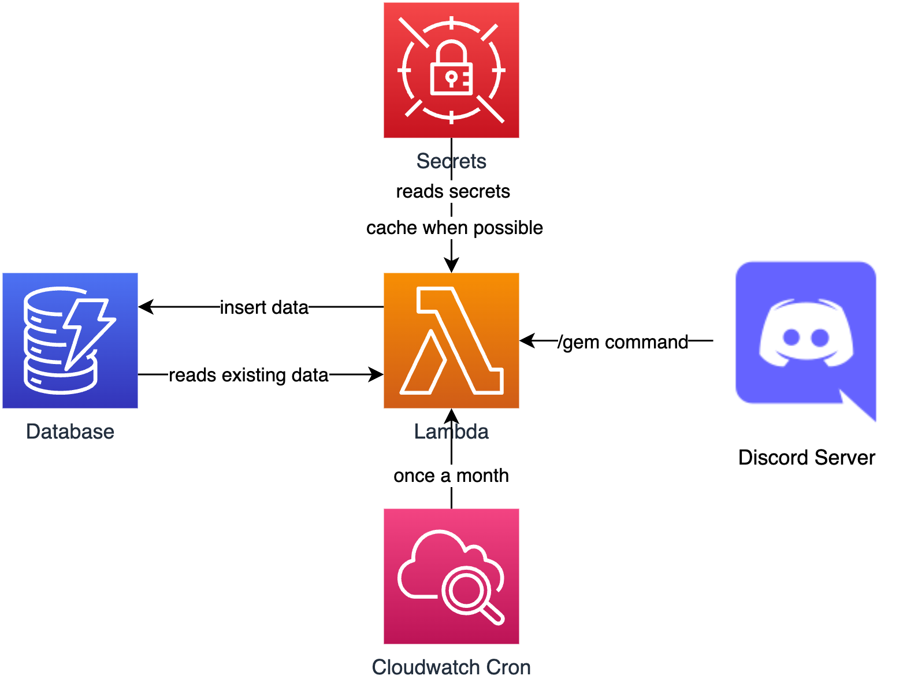

# 💎 DiscordGems 💎
A simple serverless discord bot written in python3.8 that can be used to appreciate your squad members by giving them 💎s. The given 💎s are stored and can be ranked to see who's had the most appreciation or who appreciated the most. We've created this tool here at [Craftsmen](https://craftsmenltd.com) to appreciate our colleagues for things that they do to make our lives easier.

# Architecture
The architectural diagram of this application.


## Get Familiar With 💎
https://emojipedia.org/gem-stone
For discord the short code is :gem:

## Our Commands
- `/gem appreciate <a_user> <a message containing 💎 emojis>`: Must include :gem: emoji. You can have up to `max_gems_per_day` :gem: emojis in the message
- `/gem rank`: Ranks the 💎 leader board
- `/gem opt-out`: Use this command to opt-out of receiving 💎 appreciations.
- `/gem opt-in`: Use this command to opt-in again for receiving 💎 appreciations after opting out.

*This is our implementation. We've tried to write the code in an extensible way. We will keep working on it as we see fit. We encourage the community to raise pull requests and help us fix issues.*

## Getting Started 😄
We've tried to make it as extensible as we can. Hence why there are so many parameters to set.

### Tool Set
- Python3.8
- AWS
- Docker
- Terraform

### How to Create a Discord Application with Bot 🤖
To get this application to work, you must first create a discord bot 🤖 to interact with the application. [Create Discord Application Here](docs/CreateBot.md)

### Env Variables 💻
| Variable Name | Description | Default Value |
| ------------- | ------------- | ------------- |
| `APP_ID` | Application Id from Discord | None |
| `AWS_ACCESS_KEY_ID` | Access Key Id from aws | None |
| `AWS_DEFAULT_REGION` | Default region to deploy resources in | None |
| `AWS_SECRET_ACCESS_KEY` | Secret Access Key from aws | None |
| `COMMAND` | Command in discord to register | None |
| `GUILD_ID` | Guild/Server Id from Discord | None |
| `RUNNER_IMAGE_NAME` | Runner image name | runner-image |
| `TF_BACKEND_BUCKET_KEY` | Key name to store terraform state as | None |
| `TF_BACKEND_BUCKET_NAME` | Bucket name to store terraform state in | None |
| `TF_BACKEND_BUCKET_REGION` | Region of the terraform state bucket | None |
| `TF_VARS` | An amalgamation of all required terraform variables as mentioned [here](#passing-terraform-variables-as-environment) and [here](#terraform-specific-variables) | None |

### Terraform Specific Variables
| Variable Name | Description | Default Value |
| ------------- | ------------- | ------------- |
| `prefix` | Resource names to prefix with | None |
| `discord_public_key_secret_arn` | A secrets manager arn for discord public key | None |
| `max_gems_per_day` | Maximum gems one can give per day | 5 |
| `lambda_max_concurrency` | Maximum number of lambdas that can run at a given time | 5 |
| `discord_gems_channel` | Discord channel to use the gem command in. Do not pass this value or set empty string ("") if you want to give gem from any channel | "" |
| `discord_bot_token_secret_arn` | A secrets manager arn for discord bot | None |
| `secrets_manager_cache_lambda_layer_account_id` | Secretsmanager cache lambda layer account id. Check [here](https://docs.aws.amazon.com/secretsmanager/latest/userguide/retrieving-secrets_lambda.html) for more | 176022468876 |
| `secrets_manager_cache_lambda_layer_version` | Secretsmanager cache lambda layer version. Check [here](https://docs.aws.amazon.com/secretsmanager/latest/userguide/retrieving-secrets_lambda.html) for more | 4 |

### Passing Terraform Variables as Environment
If you run the terraform code in our provided container you must pass terraform variables as TF_VARS.
Example:
```shell
TF_VARS='-var="prefix=a_prefix" -var="max_gems_per_day=5"' make run-command-in-container-deploy
```

## How to Deploy from Local Machine 💻
Run the following commands one by one. Make sure you have made sure all environment variables are set appropriately.

Build a docker image to run the code in. The image contains all required dependencies the app needs.
```shell
make build-runner-image
```
Run a quick terraform validation check.
```shell
make run-command-in-container-validate-terraform
```
Deploy terraform code
```
make run-command-in-container-deploy
```
Register the Bot with Discord
```shell
make run-command-in-container-register-bot
```
