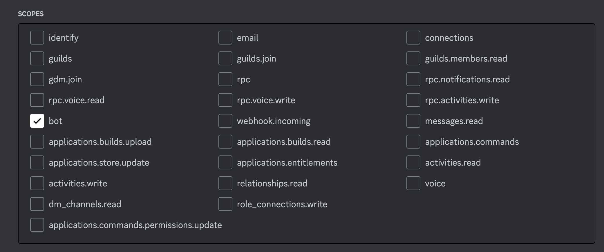

# Create Discord Bot

- Log in to discord from a web browser and open https://discord.com/developers/applications
- Click on "New Application" button from "Discord Developer Portal". 
- An Application creation dialog will be opened. Provide application name (e.g: craftsmen-app) and Team on application dialog and click on "Create" button. 
- On next page an application will be created. Copy Application ID and Public Key and save it to somewhere. We will need it later. 
- From left menu, click on "Bot". 
- A page will be appeared to add bot. 
- Click on "Add Bot" button. A dialog will be opened to proceed to add the bot. After proceeding a bot will be created. Note that you may need to apply 2FA with this procedure.
- After adding bot, copy the bot token and save it along with Application ID and Public Key that you have already saved. We will need these later.
  Note that if you can not copy bot token within short time the "Copy" and "View Token" button will disappear. Then reset the bot token and copy it. You may need 2FA verification while resetting bot token. 
- At the bottom of bot page, look for "MESSAGE CONTENT INTENT". Once found, turn it on and click "Save Changes" button. 
- Then click on "OAuth2" menu from left menu pan and click "URL Generator" sub-menu.
- From "SCOPES", check "bot". 
- From "BOT PERMISSIONS", check "Send messages". 
- Then from "GENERATED URL", copy the url. 
- Paste the url to another browser tab and hit "Enter". A dialog will be opened to add bot to your server. Selected your server from server dropdown list and click "Continue". 
- Close the browser tab after adding the bot to your server. You're done.
